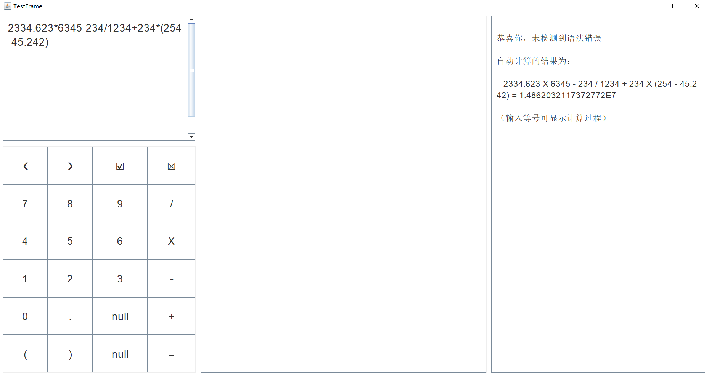
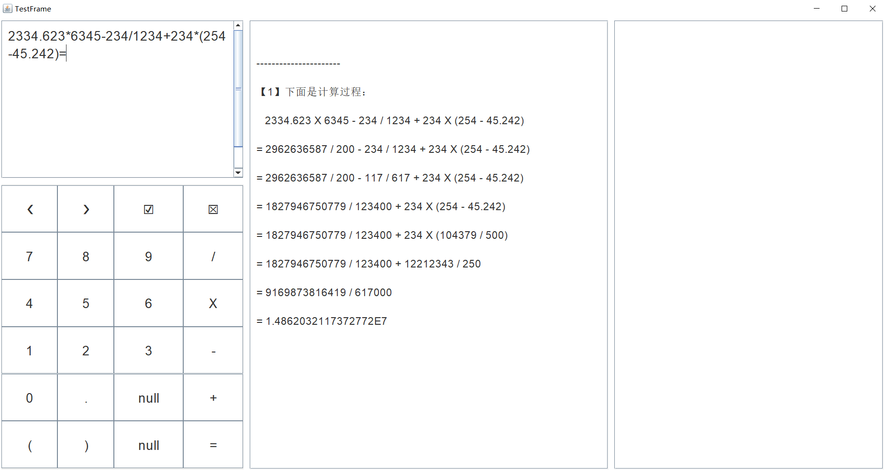

# 多功能计算器

* 此代码是作者出于兴趣爱好自己编写的。转载请注明。

* 作者的邮箱：contactwangpai@163.com

---

分支 M # 最新版本 ` M.2.1 ` 支持的功能：（以用户的角度）

1. 操作数支持多位运算。一个操作数可以是十位数或者更高位数的数
2. 操作数支持小数点、负数，运算结果支持显示小数、负数
3. 表达式可以含多个操作数、多个运算符，还可以带括号
4. 对输入的表达式提供实时自动语法检查与错误定位，并支持检查后的修改
5. 对输入无误的表达式进行实时自动计算，并可选显示完整详细的计算过程。
6. 使用 GUI 界面来显示上面的表达式输入、报错显示、运算过程
7. 提供界面按钮以供输入，按钮包含文本全选、光标左移与右移，选中文本的删除、输入替换
8. 支持键盘输入

---

 

# 本次更新介绍

——2021年8月9日

代码介绍：

&emsp;&emsp;本工程是在 本分支的上一版本的基础之上进行的升级。由于即将推出下一个版本，因此本版本的介绍从略。另外，本版本也有一些未解决的问题，这些问题将在下一版本进行解决或指出。

&emsp;&emsp;相对于版本 ` M.2.0 `，本版本 ` M.2.1 ` 的改进主要有：

* 优化了 DAO 类（类 CalculatorData）的内容，并重构了展示计算过程的算法。重构后的算法更简短，耦合性更小
* 优化了输入流类的内容
* 增加了程序启动类 CalculatorApplication
* 纠正了一些设计上的不合理

&emsp;&emsp;未来版本可能会实现的功能：

* 提供文本的清空、复制、剪切、粘贴按钮
* 提供文本的撤销和恢复快捷键

* 笔者使用的开发工具：IntelliJ IDEA 2020.1.2 (Ultimate Edition)

* 核心 Java 语言代码文件：

* 程序启动入口 API：

  类 CalculatorApplication 的方法 main：

  - 位于模块 calculator 的文件夹 java
  - 包名：org.wangpai.calculator

* Java 代码：
  - 总的代码行数为：6658
  - 单元测试代码行数为：1742

* 程序屏幕输入示例：`2334.623*6345-234/1234+234*(254-45.242)=`

* 一个屏幕输出结果的片段：

---

---

---
